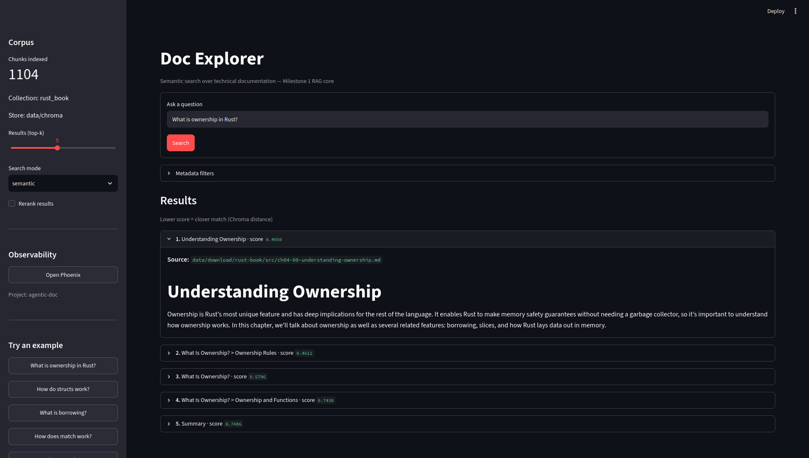

# Agentic Doc

Production-grade Agentic RAG for technical documentation — with observability, evaluation, and clean architecture.

The workspace is **domain-agnostic**: packages and apps are built to work with any technical documentation corpus (Markdown, code, PDFs, etc.). For local development, [The Rust Programming Language](https://github.com/rust-lang/book) is the reference corpus.

See [AGENTS.md](AGENTS.md) for milestones and architecture principles.

## Project structure

```
packages/
  core/     # Shared config and foundational types
  rag/      # RAG retrieval layer (chunking, embeddings, vector store)
apps/
  explorer/ # M1 RAG explorer — Streamlit UI + ingest CLI
```

## Setup

```bash
uv sync --dev
pre-commit install
```

## Development

```bash
uv run pytest
uv run ruff check .
uv run ty check
```

## M1 explorer



```bash
uv run explorer ingest   # index corpus into data/chroma
uv run explorer          # launch Streamlit search UI
uv run explorer eval     # run retrieval benchmark against golden queries
```

## Evaluation

Retrieval quality is measured against a golden query dataset (`rust_book.jsonl`) using deterministic metrics: hit@k, MRR, recall@k, and per-tag breakdowns.

```bash
# Requires an indexed corpus (see ingest above)
uv run explorer eval
uv run explorer eval --top-k 5 --output json
uv run explorer eval --fail-under 0.75   # exit 1 if hit@k is below threshold

# Optional LLM relevance scoring (requires LLM_API_KEY in .env)
uv run explorer eval --llm
PHOENIX_ENABLED=true uv run explorer eval --llm   # also uploads relevance annotations
```

Reports are saved by default to `data/eval/reports/` as timestamped JSON (`eval_20260710T120000Z.json`, `_llm` suffix when `--llm` is used). Override with `EVAL_REPORT_DIR` or `--report-dir`; use `--no-save` to skip.

Configure via `.env`: `LLM_API_KEY` (credential), plus `EVAL_TOP_K`, `EVAL_REPORT_DIR`, `EVAL_DATASET_PATH`, `EVAL_FAIL_UNDER_HIT_AT_K`, `EVAL_LLM_MODEL`.

**OpenRouter** (no OpenAI key needed — uses an OpenAI-compatible API):

```bash
# .env
LLM_API_KEY=sk-or-v1-...
LLM_BASE_URL=https://openrouter.ai/api/v1
EVAL_LLM_MODEL=openai/gpt-4o-mini

uv run explorer eval --llm --top-k 3   # start small; 17 queries × top-k LLM calls
```

## Observability (Phoenix)

Ingest and search are instrumented with OpenTelemetry spans exported to [Arize Phoenix](https://arize.com/docs/phoenix). Tracing is off by default — set `PHOENIX_ENABLED=true` in `.env` (or prefix commands below).

```bash
# Terminal 1 — UI at http://localhost:6006, collector at http://localhost:4317
uv run phoenix serve

# Terminal 2 — index and search (with tracing enabled)
PHOENIX_ENABLED=true uv run explorer ingest   # spans: ingest.run (CHAIN)
PHOENIX_ENABLED=true uv run explorer          # spans: vectorstore.search (RETRIEVER)
```

With tracing enabled, the Doc Explorer sidebar shows an **Open Phoenix** link to the local UI.

## License

MIT — see [LICENSE](LICENSE).
