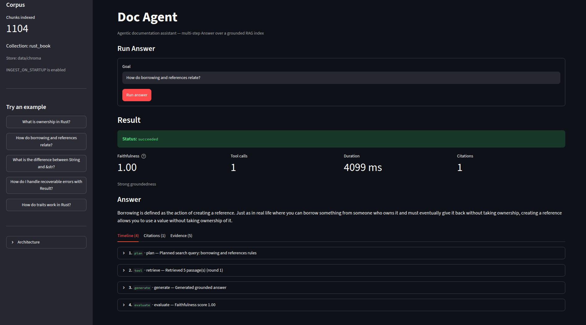

# studio

M2 **Doc Agent** Streamlit UI — Answer workflow demo for agentic documentation Q&A.

**Live demo:** [https://agentic-doc.streamlit.app/](https://agentic-doc.streamlit.app/)



Demonstrates the multi-step **Answer** workflow: plan → retrieve → generate (optional re-retrieve) → faithfulness evaluate, with timeline, citations, and evidence tabs.

## Run from the workspace root

```bash
cd path/to/agentic-doc
uv sync --dev

# index the default corpus (required for grounded answers)
uv run explorer ingest

# set LLM credentials in .env (see below)
uv run studio
```

### Prerequisites

| Need | How |
|------|-----|
| Indexed corpus | `uv run explorer ingest` (or `INGEST_ON_STARTUP` on deploy) |
| LLM credentials | `LLM_API_KEY` (+ `LLM_BASE_URL` / `LLM_MODEL` when not using OpenAI defaults) |
| Phoenix (optional) | `PHOENIX_ENABLED=true` + `uv run phoenix serve` |

Configure defaults via workspace [`.env.example`](../../.env.example).

### What you can do

- Run **Answer** on a documentation goal (sidebar examples or free text)
- Inspect **faithfulness**, tool calls, duration, and citation count
- Open **Timeline** / **Citations** / **Evidence** tabs for the last run

## LLM environment variables (studio / agent)

Studio calls `run_workflow` from `agentic-doc-agent`. It uses the **shared agent LLM settings**, not the retrieval-eval settings.

| Variable | Required? | Role |
|----------|-----------|------|
| `LLM_API_KEY` | **Yes** | API key (OpenAI, OpenRouter, Gemini AI Studio, …) |
| `LLM_BASE_URL` | If not OpenAI | OpenAI-compatible base URL |
| `LLM_MODEL` | Strongly recommended | Chat model id (default is `gpt-4o-mini`) |
| `LLM_TEMPERATURE` | No | Default `0.0` |
| `PLAN_ENABLED` | No | Default `true` |
| `MAX_TOOL_ROUNDS` | No | Default `5` |
| `FAITHFULNESS_ENABLED` | No | Default `true` |

**`EVAL_LLM_MODEL` is not used by studio.** That variable is only for M1 `explorer eval --llm` (retrieval relevance scoring). Doc Agent ignores it.

If `LLM_MODEL` is unset, the agent keeps the default **`gpt-4o-mini`**. That breaks non-OpenAI providers (e.g. Gemini returns 404 for `models/gpt-4o-mini`). Always set `LLM_MODEL` to a model your provider actually serves.

### Example: Gemini (AI Studio free tier)

```bash
LLM_API_KEY=your-gemini-api-key
LLM_BASE_URL=https://generativelanguage.googleapis.com/v1beta/openai/
LLM_MODEL=gemini-2.0-flash
```

### Example: OpenRouter

```bash
LLM_API_KEY=sk-or-v1-...
LLM_BASE_URL=https://openrouter.ai/api/v1
LLM_MODEL=openai/gpt-4o-mini
```

## Deploy (Streamlit Community Cloud)

- **Live app:** [https://agentic-doc.streamlit.app/](https://agentic-doc.streamlit.app/)
- **Main file:** `apps/studio/src/agentic_doc_studio/app.py`
- **Working directory:** repository root
- Demo markdown is under `corpora/rust-book/`

### Secrets

```toml
INGEST_ON_STARTUP = "true"
INGEST_SOURCE_DIR = "corpora/rust-book/src"
LLM_API_KEY = "..."
LLM_BASE_URL = "https://generativelanguage.googleapis.com/v1beta/openai/"
LLM_MODEL = "gemini-2.0-flash"
PHOENIX_ENABLED = "false"
```

Adjust `LLM_BASE_URL` / `LLM_MODEL` for your provider. Reboot the app after changing secrets so settings reload.

On first boot with an empty index, the app builds Chroma + BM25 from the shipped corpus (can take several minutes). Leave `INGEST_ON_STARTUP` off locally unless you want the same behavior.

## Related

- M1 search UI: [`apps/explorer`](../explorer/) ([live](https://doc-explorer.streamlit.app/))
- Agent library: [`packages/agent`](../../packages/agent/)
